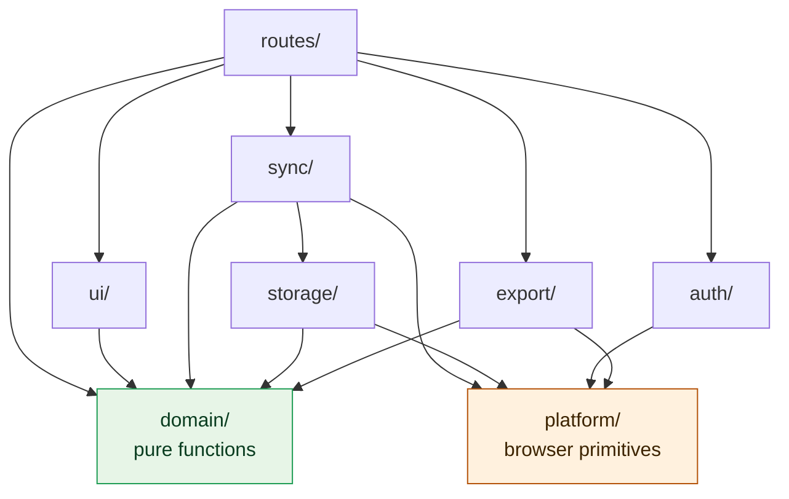
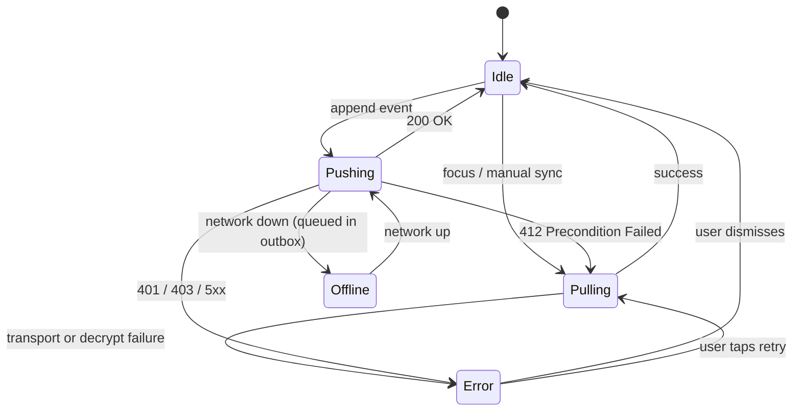
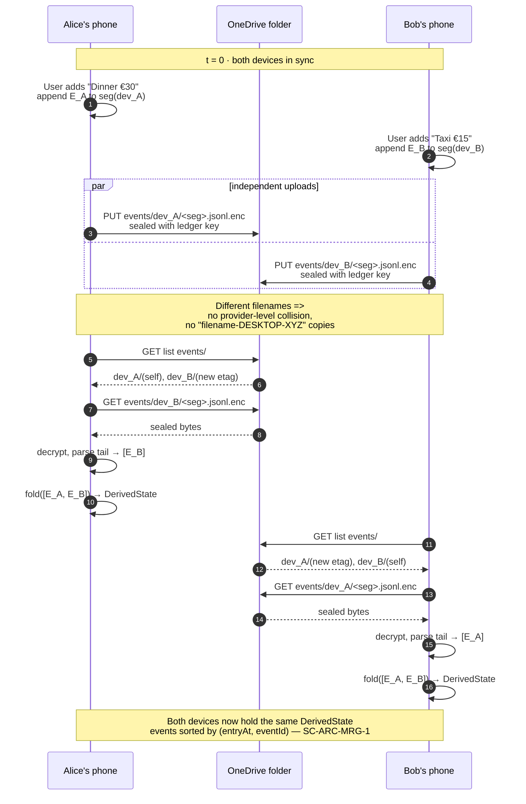

# SplitClone — Architecture Design

**Status:** draft v0.1, 2026-05-14
**Implements:** [requirements.sdoc](requirements.sdoc) v0.10

This document describes how the SplitClone PWA is structured internally so that
the requirements in the SRS can be satisfied. It is a prerequisite for starting
implementation (Q8, SC-NFR-PLT-1).

The document is organised top-down: stack → layout → each layer in turn → how
they are wired together at runtime → build/deploy.

---

## 1. Stack and core dependencies

| Concern | Choice | Rationale |
| --- | --- | --- |
| App framework | **SvelteKit** + TypeScript | Smallest compiled bundles for a PWA cold-start, reactive without virtual-DOM overhead, native TS, good PWA tooling. Decided 2026-05-14. |
| Build / dev | Vite (bundled with SvelteKit) | Default; no reason to deviate. |
| Crypto | Browser-native `crypto.subtle` (WebCrypto) | Required by SC-ARC-ENC-2; no third-party crypto library. |
| Microsoft Graph | Hand-rolled `fetch` (no SDK) — **revised in Phase 6** | The SDK adds weight for the ~4 endpoints we use (children, content GET/PUT, delete, sharedWithMe); consistent with the no-MSAL / hand-rolled-IDB anti-dependency posture. Scope is `Files.ReadWrite` (not AppFolder) so a folder one user owns+shares is reachable by others via "shared with me" — true multi-user (decided with the project owner). |
| OAuth | Hand-rolled PKCE flow (no MSAL.js) | MSAL.js is large and opinionated; PKCE is ~150 lines for what we need (SC-NFR-SEC-2). Re-evaluate if scope grows. |
| QR | `qr-creator` (pure JS, no canvas dependency) for generation; `barcode-detector` shim or `@zxing/browser` for scan | Only loaded on the join-code screens (code-split). |
| Local storage | IndexedDB via a thin custom wrapper | Avoids Dexie/idb-keyval bundle cost; our access patterns are simple. |
| Testing | Vitest (unit), Playwright (E2E) | Both first-class in the SvelteKit ecosystem. |

Anti-dependencies (deliberately not used): React, no UI component libraries
(Material, Chakra, etc. — they bloat the bundle and clash with PWA goals), no
analytics SDKs (SC-NFR-PRV-1), no MSAL.js.

## 2. Module layout

```
splitclone/
├── src/
│   ├── routes/                          # SvelteKit pages (one folder per route)
│   │   ├── +layout.svelte               # app shell, sync indicator, nav
│   │   ├── +page.svelte                 # landing: known ledgers
│   │   ├── auth/
│   │   │   ├── start/+page.svelte       # initiate MS OAuth
│   │   │   └── callback/+page.svelte    # OAuth redirect target
│   │   └── ledger/
│   │       ├── new/+page.svelte         # create ledger
│   │       ├── join/+page.svelte        # join via code
│   │       └── [ledgerId]/
│   │           ├── +layout.svelte       # ledger-scoped layout
│   │           ├── +page.svelte         # expense list (default)
│   │           ├── expense/
│   │           │   ├── new/+page.svelte
│   │           │   └── [expenseId]/+page.svelte
│   │           ├── labels/+page.svelte
│   │           ├── balances/+page.svelte
│   │           ├── settle/new/+page.svelte
│   │           ├── export/+page.svelte
│   │           └── settings/+page.svelte
│   ├── lib/
│   │   ├── domain/                      # pure functions; no I/O, no DOM
│   │   │   ├── types.ts                 # Event union, Expense, Settlement, ...
│   │   │   ├── events.ts                # event constructors + JSON codecs
│   │   │   ├── fold.ts                  # events → derived state
│   │   │   ├── splits.ts                # equal-split + rounding
│   │   │   ├── balances.ts              # pairwise balance computation
│   │   │   └── projection/
│   │   │       ├── cash.ts              # SC-FR-EXR-3 Mode A
│   │   │       └── virtual.ts           # SC-FR-EXR-3 Mode B
│   │   ├── storage/                     # all persistence I/O
│   │   │   ├── provider.ts              # SharedFolderProvider interface
│   │   │   ├── providers/
│   │   │   │   └── onedrive-graph.ts    # SC-ARC-PRV-3 impl
│   │   │   ├── encryption.ts            # AES-GCM codec (SC-ARC-ENC-2)
│   │   │   ├── join-code.ts             # encode/decode + QR (SC-ARC-ENC-4)
│   │   │   ├── segment-store.ts         # segment append/rotate (SC-ARC-LOG-4..6)
│   │   │   ├── metadata.ts              # plaintext metadata file (SC-FR-LED-3)
│   │   │   └── indexed-db.ts            # local cache + secrets (SC-NFR-SEC-2)
│   │   ├── sync/
│   │   │   ├── engine.ts                # pull/push orchestration
│   │   │   ├── outbound-queue.ts        # offline write queue
│   │   │   └── status.ts                # sync state store
│   │   ├── auth/
│   │   │   ├── pkce.ts                  # OAuth PKCE flow
│   │   │   └── token-store.ts           # token persistence
│   │   ├── export/
│   │   │   ├── csv.ts                   # SC-FR-EXR-4 formatter
│   │   │   └── deliver.ts               # browser download + Web Share
│   │   ├── platform/
│   │   │   ├── device-id.ts             # device UUID lifecycle (SC-ARC-IDN-1)
│   │   │   ├── time.ts                  # monotonic + wall-clock abstractions
│   │   │   └── service-worker.ts        # registration helper
│   │   └── ui/
│   │       ├── stores/                  # Svelte stores backed by derived state
│   │       │   ├── ledger.ts
│   │       │   ├── sync-status.ts
│   │       │   ├── filters.ts
│   │       │   └── current-device.ts
│   │       ├── components/              # reusable Svelte components
│   │       └── format/                  # display helpers (money, date, label list)
│   ├── service-worker.ts                # app-shell caching, offline launch
│   └── app.html                         # PWA shell, manifest link, CSP
├── static/
│   ├── manifest.webmanifest
│   └── icons/                           # PWA icons
├── tests/
│   ├── unit/                            # mirrors src/lib/
│   └── e2e/
├── package.json
├── svelte.config.js
├── vite.config.ts
└── tsconfig.json
```

**Layering rules (enforced by lint / import boundaries):**



Arrows point in the direction of `import`. `domain/` (green) is pure: no
`fetch`, no IndexedDB, no Svelte, no `Date.now()`, no `crypto.subtle`. Time,
randomness, and storage are injected at the boundaries. `platform/` (orange)
is the only place raw browser primitives are touched.

The cardinal rule: `domain/` is pure. No `fetch`, no IndexedDB, no Svelte, no
`Date.now()`. Time and randomness are injected. This is what makes
SC-ARC-MRG-1 (deterministic merge) demonstrable.

## 3. Domain model

```ts
// src/lib/domain/types.ts (abridged)

export type UUID = string;          // RFC 4122 v4
export type Money = bigint;         // in smallest currency unit (cents)
export type ISODate = string;       // YYYY-MM-DD
export type ISOInstant = string;    // YYYY-MM-DDTHH:mm:ss.sssZ

export type EventKind =
  | "LedgerRenamed"
  | "ParticipantAdded"      | "ParticipantRenamed" | "ParticipantClaimed"
  | "LabelCreated"          | "LabelRenamed"       | "LabelDeleted"
  | "ExpenseCreated"        | "ExpenseUpdated"     | "ExpenseDeleted"
  | "SettlementRecorded"    | "SettlementDeleted";

export interface EventEnvelope<P = unknown> {
  id: UUID;                 // event UUID
  kind: EventKind;
  schemaVersion: number;    // SC-ARC-FMT-1
  authorDeviceId: UUID;     // SC-ARC-IDN-1
  authorParticipantId: UUID;
  entryAt: ISOInstant;      // wall-clock at write (= timestamp for SC-ARC-MRG-1)
  payload: P;
}

export interface DerivedState {
  ledgerId: UUID;
  ledgerName: string;
  schemaVersion: number;
  participants: Map<UUID, Participant>;
  labels: Map<UUID, Label>;
  expenses: Map<UUID, Expense>;            // tombstoned ones excluded
  settlements: Map<UUID, Settlement>;      // tombstoned ones excluded
}
```

- **Money is `bigint` of smallest-unit (cents/pence/öre).** Avoids every
  floating-point rounding trap and makes SC-FR-SPL-2 (deterministic rounding)
  trivial. Display layer converts to/from decimal strings.
- **Maps, not arrays, in `DerivedState`.** Cheap by-UUID lookup; iteration order
  not relied on anywhere except where explicitly sorted.

### Fold algorithm (SC-ARC-MRG-1)

```ts
// src/lib/domain/fold.ts

export function fold(events: EventEnvelope[]): DerivedState {
  const sorted = [...events].sort((a, b) =>
    a.entryAt < b.entryAt ? -1 :
    a.entryAt > b.entryAt ?  1 :
    a.id < b.id ? -1 : a.id > b.id ? 1 : 0
  );
  return sorted.reduce(apply, emptyState());
}
```

`apply(state, event)` is a switch over `event.kind` that returns a new state.
Tombstones simply remove the keyed object from the relevant Map.
`ExpenseUpdated` is a wholesale replace (SC-ARC-MRG-2 last-write-wins).

Incremental fold (for sync) is `apply` over only the new tail events; this is
what makes SC-NFR-PRF-1 (1 s cold-start) achievable on growing ledgers.

## 4. Storage layer

### 4.1 SharedFolderProvider interface (SC-ARC-PRV-1/2)

```ts
// src/lib/storage/provider.ts
export interface SharedFolderProvider {
  list(path: string):                            Promise<FileEntry[]>;
  read(path: string):                            Promise<{ bytes: Uint8Array; etag: string }>;
  write(path: string, bytes: Uint8Array,
        precondition?: { ifMatch?: string; ifNoneMatch?: "*" }): Promise<{ etag: string }>;
  delete(path: string):                          Promise<void>;
}
export interface FileEntry { name: string; size: number; lastModified: ISOInstant; etag: string; }
```

The Graph implementation in `providers/onedrive-graph.ts` wraps the Graph SDK,
maps Graph's ETag/`If-Match`/`If-None-Match` semantics into the precondition
flags, and surfaces transport vs semantic errors as distinct typed errors per
SC-ARC-PRV-2.

### 4.2 On-disk layout of a ledger folder

```
<ledger-folder>/
├── ledger.json              # plaintext metadata (SC-FR-LED-3)
└── events/
    └── <device-uuid>/
        ├── 20260514T120311123.jsonl.enc   # closed segment
        ├── 20260514T180022045.jsonl.enc   # closed segment
        └── 20260515T091107200.jsonl.enc   # open segment (only one per device)
```

`ledger.json` is small and never encrypted:
```json
{
  "ledgerId": "01J2C…",
  "schemaVersion": 1,
  "createdAt": "2026-05-14T12:03:11.123Z",
  "encrypted": true,
  "keyFingerprint": "8b7f1a3d…(32 hex chars = 16 bytes)"
}
```

### 4.3 Encryption codec (SC-ARC-ENC-2)

```ts
// src/lib/storage/encryption.ts
export async function sealSegment(plaintext: Uint8Array, key: CryptoKey): Promise<Uint8Array> {
  const iv = crypto.getRandomValues(new Uint8Array(12));            // fresh per call
  const ct = new Uint8Array(await crypto.subtle.encrypt(
    { name: "AES-GCM", iv }, key, plaintext
  ));                                                                // ct = ciphertext||tag (16B)
  const out = new Uint8Array(12 + ct.length);
  out.set(iv, 0); out.set(ct, 12);
  return out;
}

export async function openSegment(sealed: Uint8Array, key: CryptoKey): Promise<Uint8Array> {
  const iv = sealed.subarray(0, 12);
  const ct = sealed.subarray(12);
  return new Uint8Array(await crypto.subtle.decrypt({ name: "AES-GCM", iv }, key, ct));
}
```

Key invariants:
- **Fresh IV every call.** Even re-uploading the same logical segment after an
  append uses a new IV. Random 96-bit IVs are safe at our scale.
- **No plaintext ever leaves this module's caller's caller.** `segment-store`
  is the only consumer; `provider` only sees the sealed blob.
- **Authenticated.** `crypto.subtle.decrypt` throws on tag mismatch.
  Higher layers translate that into a user-visible "ledger corrupted or
  wrong key" error (SC-ARC-ENC-2).

### 4.4 Segment store (SC-ARC-LOG-4/5/6)

`segment-store.ts` is the only module allowed to write to `events/<device-uuid>/`.

```ts
// Conceptual API
export interface SegmentStore {
  append(event: EventEnvelope): Promise<void>;
  list(): Promise<SegmentDescriptor[]>;             // own + others'
  readTail(seg: SegmentDescriptor, fromOffset: number): Promise<EventEnvelope[]>;
}
```

`append` flow:

```
                ┌─────────────────────────────────────────────────────┐
                │ 1. Serialize event → "<line>\n" bytes               │
                │ 2. Read open-segment plaintext from IndexedDB cache │
                │ 3. If plaintext.length + line.length > 1 MiB:       │
                │      a. Close current segment (mark immutable)      │
                │      b. Open new segment with new timestamp name    │
                │ 4. Append line to plaintext in IndexedDB            │
                │ 5. Seal updated plaintext via encryption codec      │
                │ 6. Enqueue upload to provider                       │
                └─────────────────────────────────────────────────────┘
```

Local IndexedDB holds the **sealed** segment envelope, never plaintext —
the same bytes that go to OneDrive (revised in Phase 5 from the original
"plaintext in IDB" sketch). Rationale: it makes the encryption boundary
real and independently reviewable before the OneDrive provider exists
(Phase 6), and defends data at rest even in the local browser. Append is a
read-modify-write *through* the codec (decrypt the open segment, append the
line, re-seal with a fresh IV); fold decrypts on load. The IndexedDB layout
is explicitly NOT part of the shared file format (SC-ARC-FMT-1), so this
change needs no schema-version bump and no file-format governance approval.

The 1 MiB threshold (SC-ARC-LOG-5) is a single constant `SEGMENT_THRESHOLD`
exported from `segment-store.ts`.

### 4.5 Local IndexedDB schema

`splitclone-{ledgerId}` database, object stores:

| Store | Key | Value | Purpose |
| --- | --- | --- | --- |
| `events` | composite `(deviceId, segmentName, lineOffset)` | `EventEnvelope` | Folded plaintext events from all known segments (own + remote). |
| `segments` | `(deviceId, segmentName)` | `{ etag, sealedLength, plaintextLength, status: "open"\|"closed"\|"remote" }` | Per-segment metadata for incremental sync (SC-ARC-CCH-1). |
| `outbox` | auto-id | `{ segmentName, sealedBytes, tries, lastError }` | Pending uploads when offline (SC-NFR-OFF-1). |
| `derived` | `"snapshot"` | `DerivedState` (serialised) | Cached fold output for fast cold-start. |

A global database `splitclone-app` holds the device UUID, registered ledgers,
OAuth tokens (refresh in IndexedDB, access in memory), and the data key per
ledger (non-extractable `CryptoKey` per SC-ARC-ENC-5).

## 5. Sync engine

### 5.1 Pull (refresh from OneDrive)

```
on focus / on manual sync:
    1. provider.list("events/")
    2. for each known device folder:
         for each segment file:
             if local segments[(deviceId, name)].etag === remote.etag:
                 skip
             else if local segment status == "closed":
                 skip   (immutable, but signal a sync warning — this should
                         never happen; would indicate provider misbehavior)
             else:
                 sealed = provider.read(segment.path)
                 plaintext = encryption.openSegment(sealed, key)
                 newTail = parseLines(plaintext, from = local.plaintextLength)
                 indexed-db.appendEvents(newTail)
                 indexed-db.updateSegment(etag, plaintextLength)
    3. fold.incremental(newTail) → updated DerivedState
    4. ui-stores publish update
```

### 5.2 Push (upload pending writes)

```
on append:
    enqueue { segmentName, sealedBytes }
on network online / on debounce 500 ms:
    while outbox non-empty:
        item = outbox.peek()
        ifMatch = segments[item.segmentName].remoteEtag
        result = provider.write(path, sealedBytes, { ifMatch })
        if 412 Precondition Failed:        # another device wrote after our last pull
            run pull cycle first, then merge our delta + retry
        else:
            outbox.pop()
            segments[item.segmentName].remoteEtag = result.etag
```

ETag-based conditional write is what prevents a stale upload from overwriting
a newer remote state. Because each device only writes to its own segments,
412s should be **rare** — they only happen across an OS-level "duplicate the
app" edge case. When they do, we re-pull and retry.

### 5.3 Status indicator (SC-FR-SYN-3)

`sync-status` Svelte store, subscribed by the app shell to render an icon
in the top bar.



The 412 → Pulling edge is the one that absorbs the OS-level
"duplicate-the-app" edge case where two clients race on the same segment;
the device pulls the newer remote state, replays its own pending delta on
top, and retries.

### 5.4 Concurrent-write convergence (SC-ARC-MRG-1 worked example)

Two devices add an expense at roughly the same wall-clock instant. They
each write only to their own segment file, then sync, then both arrive at
the same `DerivedState`.



The convergence is purely a property of `fold` being a pure function over
a sorted set; nothing in the sync engine has to do conflict resolution
because the segments themselves never conflict.

## 6. Export engine (SC-FR-EXR-*)

```ts
// src/lib/export/csv.ts
export function buildExportRows(
  state: DerivedState,
  participantId: UUID,
  mode: "cash" | "virtual",
  filters: ExportFilters,
): ExportRow[] { /* pure */ }

export function rowsToCsv(rows: ExportRow[]): string { /* RFC 4180 */ }
```

`projection/cash.ts` and `projection/virtual.ts` implement the two semantics
from SC-FR-EXR-3 as pure functions over `DerivedState`. `csv.ts` only formats.
Browser delivery happens in `export/deliver.ts` via a Blob URL + anchor click;
on `navigator.canShare({ files: [...] })` we offer Web Share too
(SC-FR-EXR-6).

## 7. Auth (SC-NFR-SEC-2)

```
                                   ┌──────────────────────────┐
                                   │ User taps "Connect       │
                                   │ OneDrive" in /auth/start │
                                   └────────────┬─────────────┘
                                                ▼
        verifier + challenge                    redirect to login.microsoftonline.com
        stored in sessionStorage   ────────────────────────────────────────▶
                                                                              user
                                                              ◀───────────── auths
        /auth/callback?code=…                                                  │
                ▼                                                              │
        POST /token with code + verifier                                       │
                ▼                                                              │
        access_token (in memory) + refresh_token (IndexedDB)                   │
```

Token use:
- Access tokens never persisted; they live in a closure inside `token-store.ts`.
- Refresh tokens encrypted at rest in IndexedDB using a WebCrypto-derived
  key bound to the origin (best-effort; the wrapping key itself necessarily
  lives somewhere, so this is defence-in-depth, not a hard guarantee — exactly
  the trade-off SC-NFR-SEC-2 calls out).
- Scopes requested at sign-in: `Files.ReadWrite` (folder-restricted via
  Graph's "select a folder" flow once available; otherwise the minimal
  user-confirmable set). No mail / calendar / contacts.

## 8. UI layer

Three Svelte stores are the primary surfaces:

| Store | Type | Source of truth |
| --- | --- | --- |
| `currentLedger` | `Writable<DerivedState \| null>` | `fold` over events from IndexedDB |
| `syncStatus` | `Writable<SyncStatus>` | sync engine |
| `filters` | `Writable<{ dateFrom, dateTo, participantId, labelIds }>` | URL query string |

Routing notes:
- Filters live in the URL so deep links + back/forward work.
- `+layout.svelte` at `ledger/[ledgerId]/` subscribes to `currentLedger` and
  passes the derived state down via context; child routes pull selectively.
- Forms are uncontrolled Svelte components emitting domain events; submitting
  invokes a single `dispatch(command)` API that ends in `segment-store.append`.

A reusable `<MoneyInput>` component takes/returns `bigint` cents and never
floats.

## 9. Service Worker (SC-NFR-OFF-1) — Phase 8

Implemented as `src/service-worker.ts` using SvelteKit's built-in
`$service-worker` module. **Deviation (deliberate, same anti-dependency
posture as hand-rolled Graph/PKCE/IDB): no `vite-plugin-pwa`.** SvelteKit
already bundles + auto-registers the file from the built shell on `load`
(production only, never in `dev`) and exposes the precise `build`/`files`/
`version` lists — a plugin would add a dependency for nothing.

- **Precache on install:** `build` (hashed immutable) + `files` (static,
  incl. manifest + icons) + the SPA shell (`base + '/'`). Best-effort
  (`Promise.allSettled`) so one unreachable asset can't fail the install.
- **Assets:** cache-first (content-hashed, safe to serve stale).
- **Navigations:** network-first, falling back to the cached shell so a
  cold offline launch still boots; the client router then resolves the
  route from IndexedDB.
- **Cross-origin (`graph.microsoft.com`, OneDrive CDN): never intercepted**
  — the SW returns without calling `respondWith`, so sync/auth always hit
  the live network. Offline write durability is the data layer's job, not
  the SW's: writes land in sealed IDB segments immediately and the sync
  engine retries on `online`/focus (Phase 7), so there is no separate
  outbox store.
- `activate` deletes caches whose key ≠ `splitclone-${version}`.
- No Background Sync API on iOS Safari — push attempts ride app focus /
  the post-commit debounce (SC-FR-SYN-1).

## 10. Encryption key lifecycle

```
Ledger creation:
    1. crypto.subtle.generateKey({ name: "AES-GCM", length: 256 }, /*extractable*/ true, ["encrypt","decrypt"])
    2. exportKey raw bytes ─▶ derive joinCode + fingerprint
    3. importKey raw bytes ─▶ NON-extractable handle, persist in IndexedDB
    4. exportable raw bytes wiped from memory; only the joinCode + fingerprint
       persist past this point
    5. UI nags "Save your recovery code" (SC-ARC-ENC-6)

Joining an existing ledger:
    1. user pastes/scan join code
    2. decode + verify checksum
    3. importKey as NON-extractable
    4. fold over fetched encrypted segments → if any segment decrypt-fails on
       the first event, abort and warn "wrong code" (UX failsafe in addition
       to the fingerprint check)
    5. fingerprint check vs metadata file (SC-ARC-ENC-3); persist key on pass
```

The "extractable for 1 nanosecond at creation" window is the only time raw
key bytes exist outside WebCrypto. After step 4 of creation, the join code
string is the only externalised form.

## 11. Build, deploy, verifiability (SC-ARC-HST-1/2)

- Public GitHub repo. CI builds the static bundle and writes a release
  manifest `bundle-manifest.json` enumerating every asset path with its
  SHA-256.
- GitHub Pages deployment uses the `adapter-static` output verbatim
  (no `vite-plugin-pwa`; the Service Worker is hand-rolled — see §9). The
  release tag in Git should equal the SvelteKit `version` baked into the
  Service Worker cache key (`splitclone-${version}`) so a user can verify
  which version they're running. (Pinning `version` to the commit SHA is
  part of the Phase 9 v1.0/verifiability hardening.)
- `index.html` includes a `<meta name="splitclone-build" content="…">` with
  the commit SHA so support requests can identify exactly which build is
  affected.
- Subresource Integrity hashes are emitted by the build for every
  `<script src=…>` and `<link rel=stylesheet>` (SC-ARC-HST-2).

## 12. Threading and async model

- **Main thread only** for MVP. All work is `async`/`await`; the heavy
  primitives (`crypto.subtle.*`, IndexedDB) are already off-main-thread
  internally.
- **Service Worker** for app-shell cache only; no business logic.
- **Web Workers** considered for the `fold` of large logs; rejected for MVP
  because at the SC-ARC-LOG-5 sizing (~1000 events per segment) folding stays
  under 50 ms on mid-range hardware. Re-evaluate when a real ledger crosses
  10k+ events.

A single rule keeps the UI responsive: any operation that touches `fetch` or
`crypto.subtle` or IndexedDB MUST set `syncStatus` to a non-idle state before
awaiting, so the user always sees something happening.

## 13. Traceability (modules → requirements)

| Module / file | Implements |
| --- | --- |
| `domain/fold.ts` | SC-ARC-MRG-1, SC-ARC-MRG-2 |
| `domain/splits.ts` | SC-FR-SPL-1, SC-FR-SPL-2, SC-FR-SPL-3 |
| `domain/balances.ts` | SC-FR-BAL-1, SC-FR-BAL-2 |
| `domain/projection/cash.ts` | SC-FR-EXR-3 (Mode A) |
| `domain/projection/virtual.ts` | SC-FR-EXR-3 (Mode B) |
| `storage/provider.ts` + `providers/onedrive-graph.ts` | SC-ARC-PRV-1, SC-ARC-PRV-2, SC-ARC-PRV-3 |
| `storage/encryption.ts` | SC-ARC-ENC-1, SC-ARC-ENC-2 |
| `storage/join-code.ts` | SC-ARC-ENC-4 |
| `storage/segment-store.ts` | SC-ARC-LOG-1, SC-ARC-LOG-3, SC-ARC-LOG-4, SC-ARC-LOG-5, SC-ARC-LOG-6 |
| `storage/metadata.ts` | SC-FR-LED-1, SC-FR-LED-2, SC-FR-LED-3, SC-ARC-ENC-3 |
| `storage/indexed-db.ts` | SC-ARC-CCH-1, SC-NFR-SEC-2, SC-ARC-IDN-1, SC-ARC-ENC-5 |
| `sync/engine.ts` + `sync/outbound-queue.ts` | SC-FR-SYN-1, SC-FR-SYN-2, SC-NFR-OFF-1 |
| `sync/status.ts` | SC-FR-SYN-3 |
| `export/csv.ts` + `export/deliver.ts` | SC-FR-EXR-4, SC-FR-EXR-5, SC-FR-EXR-6, SC-FR-EXR-7 |
| `auth/pkce.ts` + `auth/token-store.ts` | SC-NFR-SEC-2 |
| `platform/device-id.ts` | SC-ARC-IDN-1, SC-ARC-IDN-2 |
| `service-worker.ts` | SC-NFR-OFF-1 |
| `app.html` (CSP, SRI) | SC-NFR-SEC-2 mitigations, SC-ARC-HST-2 |
| `bundle-manifest.json` (CI output) | SC-ARC-HST-2 |
| `routes/**` | every SC-FR-* user-facing requirement |
| (CHANGELOG.md, future) | SC-ARC-FMT-3 |

Every architectural module above traces to at least one SC- requirement. The
inverse is also tracked: every SC-FR-* and SC-NFR-* requirement is covered by
at least one module in the table.

## 14. Open architectural questions

A1. **Wrapping key for refresh tokens.** The PKCE flow yields a refresh token
    we want to encrypt at rest. The wrapping key has to live somewhere; in a
    browser, that "somewhere" is itself in browser storage. The plan is to
    derive a per-origin AES key non-extractably via `crypto.subtle.generateKey`
    on first run and persist its `CryptoKey` handle in IndexedDB. This is
    defence-in-depth but not a hard guarantee; same posture as the ledger
    data key. Worth a security-pass review before implementation begins.

A2. **Folder picker UX.** Graph offers a "Pick a folder" API but the exact
    flow on iOS Safari (popup vs full-page redirect) needs prototyping. The
    architecture above is agnostic to which one we use.

A3. **Bundle splitting.** Routes are obvious split points; the QR scanner is
    a fat dependency that should be a lazy chunk. Worth a `rollup-plugin-visualizer`
    pass before merging the first PR that crosses the 200 KB initial-bundle
    threshold.

A4. **Test strategy for encrypted segments.** End-to-end tests need a fake
    `SharedFolderProvider` (in-memory) and a deterministic source of randomness
    for IV generation. The domain layer's purity makes this easy; storage and
    sync need a small DI seam.

These do not block implementation start once Q8 is signed off; they are
notes for the implementer.
